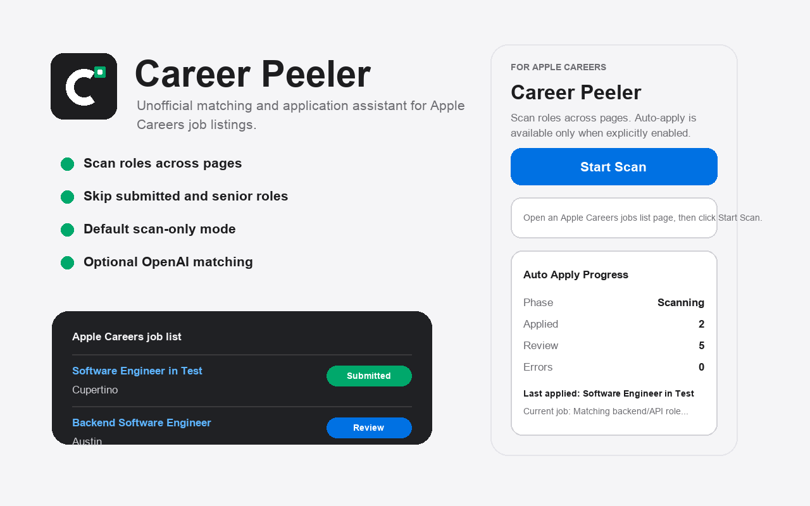
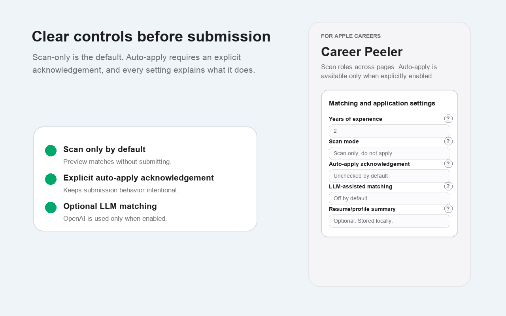
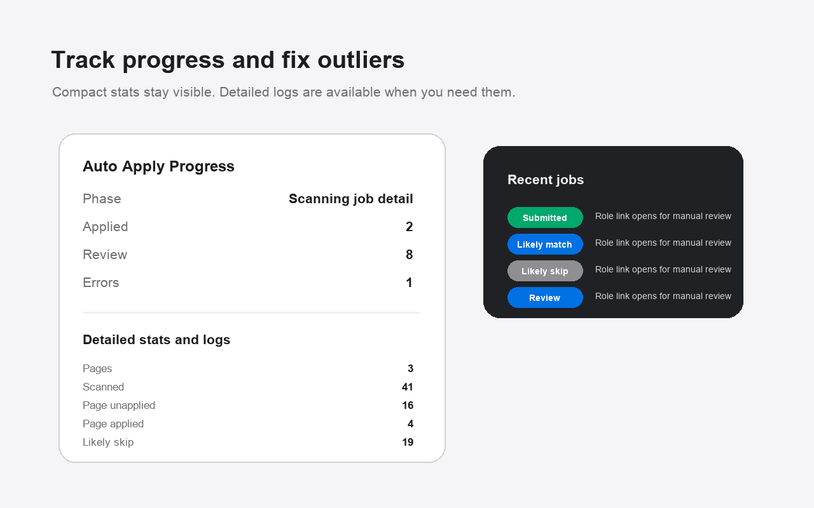

# Career Peeler

Unofficial tool that scans Apple Careers, TikTok Careers, and ByteDance Careers job lists, classifies each role against your profile, and can optionally auto-apply. This project is not affiliated with Apple, TikTok, or ByteDance.

Two interfaces share the same matching/apply logic: a **Chrome extension** (friendlier UI, reuses your logged-in browser tab) and a **command-line tool** (for headless/scheduled runs, e.g. via cron). They keep separate local job-tracking history — scanning via one doesn't inform the other.

## How it works

**1. Open a job list page and start a scan.** Career Peeler reads every visible job link on the page and works through them one by one in a background tab, so your active tab is left alone.



**2. Each job gets classified locally** — years-of-experience, tech-stack overlap with your profile, and any no-match keywords you've set — before anything is ever sent to an LLM. Scan-only mode is the default: nothing gets submitted until you explicitly turn on auto-apply.



**3. Watch progress and review what happened.** Live stats show how many were applied, need review, or hit an error, and every job is logged with a link back to it for manual follow-up.



### Stored job statuses

| Status | Meaning |
| --- | --- |
| `seen` | Scanned, no strong match/skip signal |
| `reviewed` | Worth a manual look |
| `likely_match` | Strong local fit |
| `likely_skip` | Poor fit, or hard-skipped (seniority, internship, YOE, no-match keyword) |
| `submitted` | Already applied, or detected as already submitted |

Previously scanned jobs are skipped across sessions, and pagination advances automatically when the current list page is exhausted.

## What it does

- **Scans** Apple Careers, TikTok Careers, and ByteDance Careers list pages, across pagination, skipping jobs it's already seen.
- **Classifies** each job locally by years-of-experience requirements, tech-stack keyword overlap with your profile, and your own no-match keyword denylist — with optional OpenAI-assisted matching for closer calls (off by default; only sends job text and your profile summary when enabled).
- **Hard-skips** senior/staff/principal/lead titles, internships, and roles that clearly exceed your years of experience, before any LLM call.
- **Auto-applies** (only once explicitly acknowledged in settings) by working through each site's application steps, answering common work-authorization/visa questions, and submitting — then logs failures with enough detail (site, error type, page heading, recovery link) to fix and re-submit manually.
- **Stores everything locally** in Chrome storage. Does not upload files or create profile data — the workflow assumes your Apple Careers profile, resume, and LinkedIn are already saved on the site itself.

## Load locally (Chrome extension)

1. Open Chrome and go to `chrome://extensions`.
2. Turn on Developer Mode.
3. Click `Load unpacked` and select this folder.
4. Open a supported careers list page and click `Start Scan`. Auto-apply stays off until you enable it under `Matching and application settings`.

## Command-line tool

Drives a real (Playwright-controlled) Chromium browser instead of a Chrome extension popup — useful for headless or scheduled runs. It reuses `content.js` and the shared matching/LLM logic in `lib/core.js` verbatim; only the browser-automation layer (`cli/`) differs from the extension's `background.js`.

```bash
npm install                        # installs playwright
npx playwright install chromium    # one-time browser download (skip if already cached)

node cli/index.js login apple      # opens a browser window; log in manually, then press Enter
node cli/index.js config --set userYearsOfExperience=3 --set scanMode=scan_only
node cli/index.js scan https://jobs.apple.com/en-us/search
```

Or, after `npm link` (or installing globally), use the `career-peeler` command directly, e.g. `career-peeler scan <list-url>`.

Other commands: `config` (view/update your profile), `status` (print the current/last scan), `stop` (stop a scan running in another terminal), `history [--clear]` (view/clear tracked job records), `apply <application-url>` (run the apply workflow against an already-open application page). Run `career-peeler --help` for the full flag list.

Data (browser session, profile, scan state, job records) lives in `~/.career-peeler/` by default (override with `--data-dir` or `$CAREER_PEELER_DATA_DIR`) — deliberately outside the repo, since it holds your OpenAI API key and login session.

## Publishing checklist

- Verify extension icons render correctly in Chrome and add Chrome Web Store screenshots.
- Use the generated Chrome Web Store images in `store-assets/`: three `1280x800` screenshots, `promo-small-440x280.png`, `promo-marquee-1400x560.png`, and `store-icon-128x128.png`.
- Host a public privacy policy based on `PRIVACY.md` and link it from the Chrome Web Store Developer Dashboard.
- Keep scan-only as the default so users can preview decisions without submitting.
- Ensure listing copy clearly states that OpenAI matching is optional and sends job/profile text externally only when enabled.
- Add resume upload/reset UI before publishing beyond personal use.
- Avoid Apple logos or wording that implies affiliation.
- Keep permissions limited to supported careers hosts, optional OpenAI access, storage, tabs, and scripting.
- Run the pre-publish checklist in `TEST_CASES.md`.

## Next milestones

1. Test list scanning across several Apple search result pages and log false positives.
2. Refine submitted-state and next-page selectors after inspecting real Apple DOM variations.
3. Refine application field categories across real application steps.
4. Refine login/session-state detection and stronger confirmation-state detection across more real site variants.
5. Add configurable auto-apply criteria for `Likely match`, `Review`, and `Unknown`.
